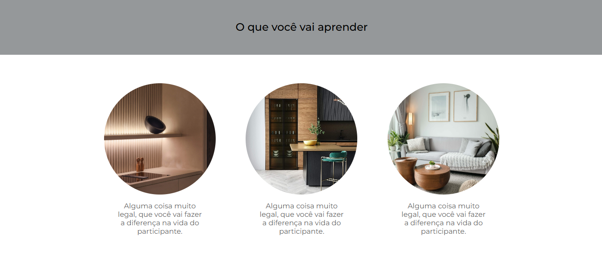
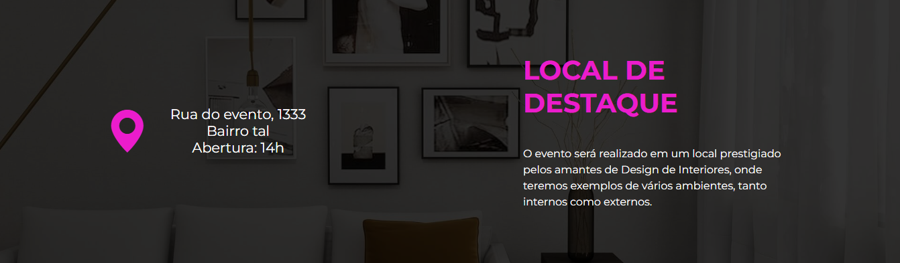
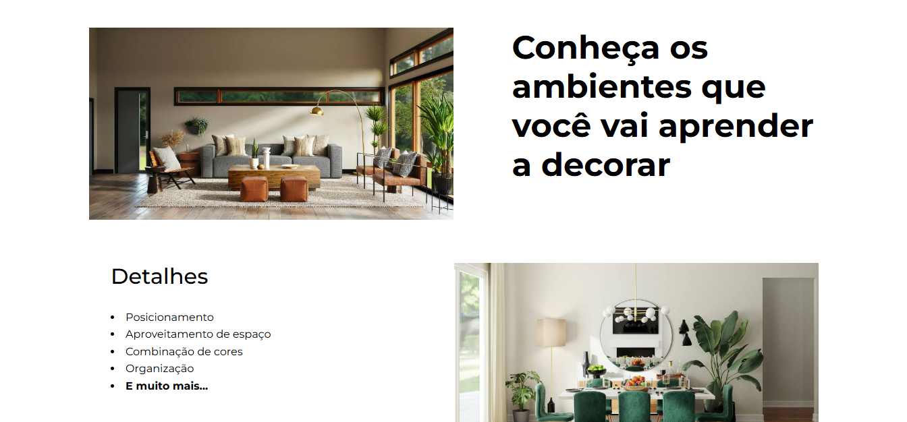
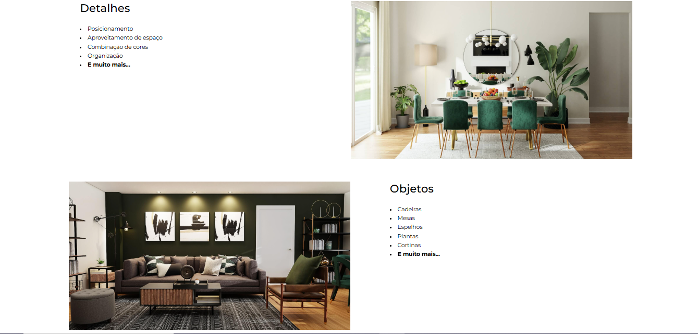
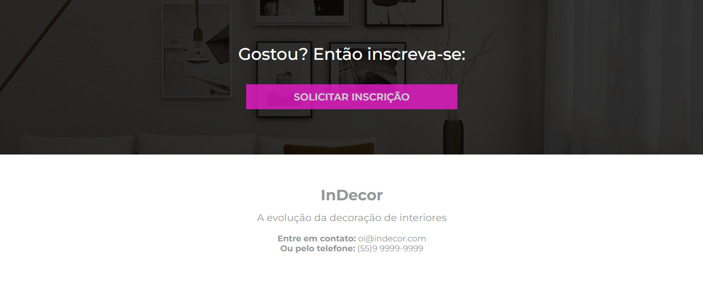

# inDecor
 
Este projeto é uma landing page para o evento **InDecor**, criado com HTML5 e CSS3. A página tem um design moderno e responsivo, proporcionando uma experiência envolvente para os visitantes.

---

📌 **Funcionalidades**

- Design elegante e profissional
- Informações detalhadas sobre o evento
- Formulário de inscrição interativo com campos para nome, e-mail, telefone e interesse
- Botão de chamada para ação estilizado para incentivar inscrições
- Layout totalmente responsivo, adaptável a diferentes dispositivos

---

🚀 **Tecnologias Utilizadas**

- HTML5 para a estrutura da página
- CSS3 para estilização e responsividade
- Flexbox e Grid para um layout organizadoHTML5 para a estrutura da página

---

🎨 **Estilização**

A página foi projetada com um visual moderno e sofisticado, destacando-se pelos seguintes pontos:

- Tipografia elegante para melhor leitura
- Paleta de cores escuras e detalhes vibrantes para impacto visual
- Elementos bem distribuídos para uma navegação fluida e intuitiva
- Botões estilizados para destacar ações importantes

---

📷 **Captura de Tela** 






---

🔧 **Como Usar**

1. Clone este repositório:

   ```bash
   git clone https://github.com/seu-usuario/inDecor-landing-page.git

2. Abra o arquivo `index.html` no seu navegador.

🎯 **Objetivo do Projeto**

Este projeto foi desenvolvido com o objetivo de praticar e demonstrar habilidades em desenvolvimento web, incluindo HTML, CSS, design responsivo e experiência do usuário (UX/UI).

📜 **Licença**

Este projeto foi desenvolvido para fins educacionais e pode ser usado livremente.


